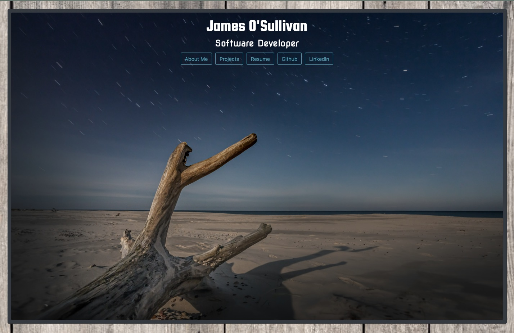

# Responsive Portfolio

---

Building with a mobile-first mindset is of the utmost importance for websites and applications to seemlessly transition from a desktop to a mobile screen. This application will showcase the abilities of responsive design and will consist of a main introductory page, a past and current projects page and a contact page.

---
### Inside the Portfolio

---
### Links

---

- [Github Repo](https://github.com/jamesosull16/Portfolio)
- [Portfolio Page](https://jamesosull16.github.io/Portfolio/)

---

### Resources

---

- Bootstrap
- Unsplas
- Google Fonts

---
